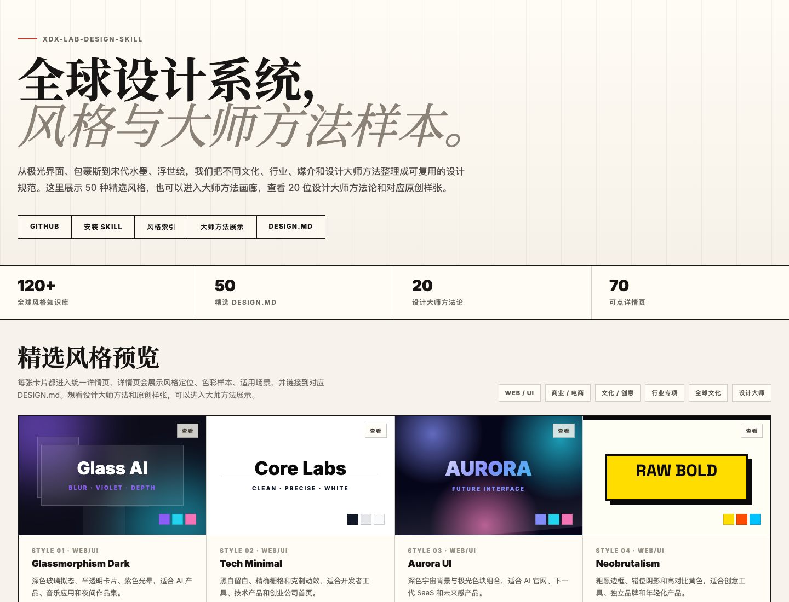
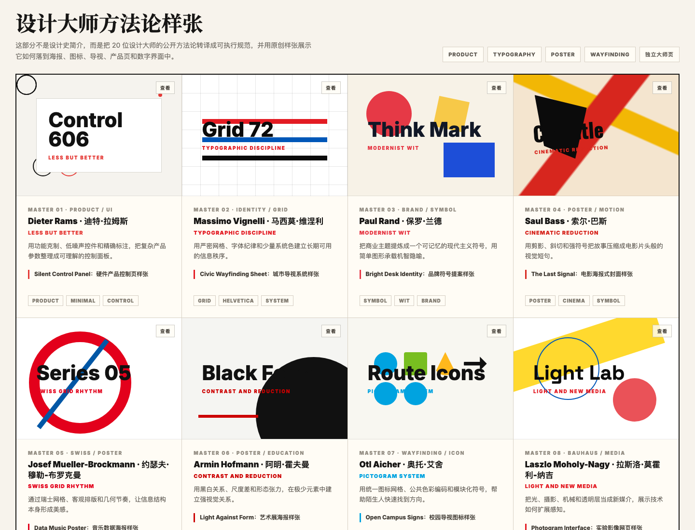
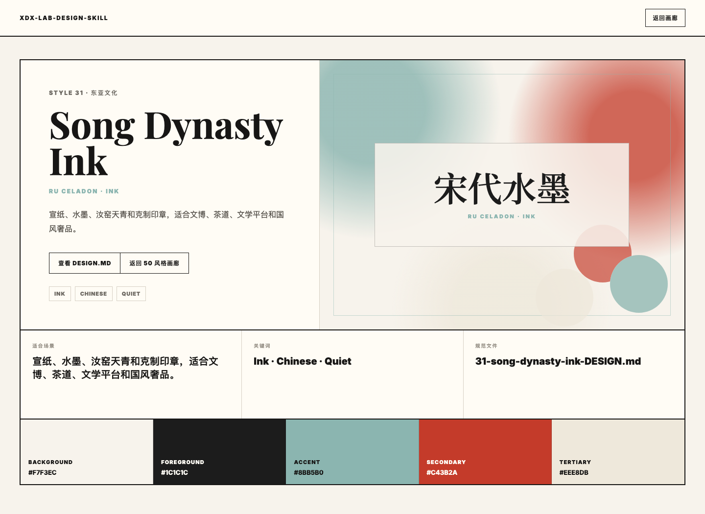
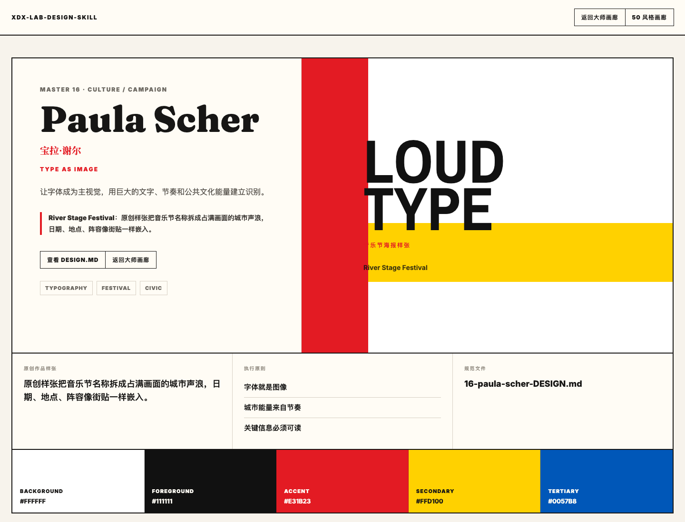

# xdx-lab Design Style Skill
### 全球设计系统 — 50 种精选视觉语言 + 20 位设计大师方法论 + 120+ 风格知识库

> 一个面向所有智能体的设计风格 Skill，适用于 Codex / Code X / Claude Code / Cursor / v0 / Bolt / Lovable / DeepSeek / Gemini / 任何能读取 Markdown 与仓库文件的 Agent。

---

## 是什么？

这是一个面向 Agent 的全球设计系统。它把不同文化、行业、媒介和设计大师方法整理成可执行的 `DESIGN.md`：颜色、字体、组件、版式、视觉隐喻、禁忌和输出规则都写在同一份规范里。

它不是简单的配色表，也不是提示词合集。目标是让 Agent 在制作网页、PPT、海报、App UI、报告或组件时，能先选择合适的视觉语言，再按明确的生产路线交付真实文件；如果用户指定某位设计大师，也能把大师的方法论转译成构图、排版、图标或交互层面的执行规则。

**核心特性：**
- **50 个精选 DESIGN.md**：每个风格都有精确 HEX 色彩、字体层级、组件规范、版式原则和禁忌清单。
- **20 位设计大师方法论**：整理 Dieter Rams、Vignelli、Paul Rand、Saul Bass、Kenya Hara、Paula Scher、Susan Kare 等方法，用于指导构图、信息层级、图标、排版和视觉隐喻；每位都有独立 `DESIGN.md` 和原创展示样张。
- **120+ 风格知识库**：精选库之外的风格，可从知识库中提取关键特征并动态合成规范。
- **Agent 无关**：纯 Markdown + HTML 结构，任何能读取仓库文件的智能体都可以使用。
- **输出路线清晰**：覆盖网站、React 组件、PPT、海报、App UI、Word/报告和 Figma 设计稿。
- **强调视觉资产**：按场景选择用户素材、Unsplash、生成式图片、SVG 图形或风格化图案，避免只做文字排版。

---

## 效果展示

在线预览：[GitHub Pages 统一画廊](https://xdx888999.github.io/xdx-lab-design-skill/)  
[大师方法页](https://xdx888999.github.io/xdx-lab-design-skill/masters.html)。

### 50 种精选风格 + 20 位大师方法



### 设计大师方法样张



### 单个风格详情页



### 单个大师方法详情页



---

## 风格覆盖

| 分类 | 风格数 | 示例 |
|------|--------|------|
| Web/UI 核心 | 10 | Glassmorphism, Aurora UI, Neobrutalism, Fintech |
| 商业/电商 | 5 | E-commerce, Luxury Premium, SaaS Dashboard |
| 文化/创意 | 10 | Japandi, AI-Native, Bauhaus, Art Deco |
| 复古/亚文化 | 5 | Synthwave, Cyberpunk, Y2K, Vaporwave, 国潮 |
| 出版/演示 | 5 | Editorial Magazine, Academic, Startup Pitch |
| App 专项 | 5 | Kawaii, Claymorphism, Pixel Art, Material You |
| 东亚文化 | 5 | **宋代水墨**, 唐代华彩, 民国海报, 浮世绘, 禅意侘寂 |
| 行业专项 I | 5 | 医疗健康, 法律权威, 教育平台, 豪宅地产, 高端餐饮 |
| 行业专项 II | 5 | 金融企业, 电竞, 时尚编辑, 旅行酒店, 公益NGO |
| 全球文化 | 5 | 伊斯兰几何, 非洲未来主义, 波普艺术, 暗系学院, 野蛮主义 |
| 设计大师方法论 | 20 | Dieter Rams, Vignelli, Paul Rand, Saul Bass, Kenya Hara, Paula Scher, Susan Kare |

---

## 安装方式

### 方式 1：让你的 Agent 通过仓库链接安装（推荐）

如果你的 Agent 支持安装 Skill、读取 GitHub 仓库或管理本地能力包，可以直接把仓库链接交给它：

```text
请根据这个 GitHub 仓库帮我安装并启用 design-style Skill：
https://github.com/xdx888999/xdx-lab-design-skill

安装后，请读取 SKILL.md。之后当我要求制作网页、PPT、海报、App UI、报告或组件时，请先用它选择风格，再按对应输出路线生成文件。
```

适用于 Codex / Code X / Claude Code / Cursor 等可访问本地文件或 GitHub 仓库的 Agent。不同工具的 Skill 目录不同，请让对应 Agent 按它自己的规范安装。

### 方式 2：克隆仓库作为本地 Skill 使用

```bash
git clone https://github.com/xdx888999/xdx-lab-design-skill.git
```

然后把仓库目录加入你所使用 Agent 的 Skill / Memory / Knowledge / Context 目录，或在对话中明确告诉 Agent：

```text
请把这个仓库当作 design-style Skill 使用。
优先读取 SKILL.md；需要选择风格时读取 references/style-index.md；
需要具体规范时读取 references/styles/ 中对应的 DESIGN.md。
如果我指定某位设计大师或“更有大师方法论”，请读取 references/masters/master-index.md，
再读取 references/masters/ 中对应的 DESIGN.md。
```

### 方式 3：不安装，直接引用某个 DESIGN.md

如果你只想临时使用某个风格，可以复制单个文件到项目中：

```bash
cp references/styles/31-song-dynasty-ink-DESIGN.md /path/to/your/project/DESIGN.md
```

然后在任意 AI 工具中说：

```text
请按照项目里的 DESIGN.md 设计规范，实现这个页面/组件/PPT。
```

---

## 如何触发 Skill

安装或引用后，以下任意说法都适合作为触发语：

```
"我要设计一个 PPT，先帮我推荐几个风格"
"我要做一个 AI 产品官网，你推荐适合的视觉方向"
"帮我做一个宋代水墨风格的落地页"
"用 Glassmorphism 风格设计这个组件"
"给我做一个金融科技公司官网，配色要专业"
"制作一个电竞赛事品牌页面"
"设计一个米其林餐厅的在线菜单"
"参考 Dieter Rams 方法设计一个硬件产品页"
"用 Paula Scher 的字体主视觉方法做一个音乐节海报"
"用原研哉的空白感做一本品牌手册"
```

### 风格选择方式

- **未指定风格时**：Agent 先从 50 种精选风格中推荐 2-3 个方向，并等待你选择。
- **直接指定风格时**：Agent 立即匹配对应 DESIGN.md，例如“用宋代水墨”“用 Art Deco”“用 42 电竞风”。
- **直接指定设计大师时**：Agent 立即读取 `references/masters/` 中对应方法论，例如“参考 Dieter Rams”“像 Saul Bass 的电影海报构图”“用 Susan Kare 的像素图标逻辑”。
- **风格与大师叠加时**：Agent 会同时读取两个规范，例如“浮世绘 + Saul Bass 构图”，让风格控制视觉气质，大师方法控制结构和表达。
- **精选库没有对应风格时**：Agent 从 120+ 风格知识库中提取特征，动态合成一份可执行设计规范。
- **需要图片时**：Agent 会判断是否使用用户素材、Unsplash、生成式图片、SVG 图示或图案纹理，并在交付中说明来源与处理方式。
- **回复方式**：你可以回复编号、风格名、中文描述，或直接说“你来定”。

---

## 文件结构

```
design-style-skill/
├── SKILL.md                          # 主指令文件（AI 的行动手册）
├── README.md                         # 本文件
├── docs/
│   ├── index.html                    # GitHub Pages 统一画廊（50 风格 + 20 大师）
│   ├── style.html                    # 通用风格详情页
│   ├── style-data.js                 # 50 种风格展示数据
│   ├── masters.html                  # 20 位设计大师方法论画廊
│   ├── master.html                   # 通用大师详情页
│   ├── master-data.js                # 20 位大师展示数据
│   └── assets/                       # README 截图资源
└── references/
    ├── style-index.md                # 50 种风格目录索引（轻量，先读此文件）
    ├── 全球设计风格知识库.md           # 120+ 种风格知识库（兜底动态生成）
    ├── styles/
    │   ├── 01-glassmorphism-dark-DESIGN.md
    │   ├── 02-tech-minimal-DESIGN.md
    │   ├── ...（共 50 个文件）
    │   └── 50-brutalist-web-DESIGN.md
    └── masters/
        ├── master-index.md           # 20 位设计大师方法论索引
        ├── 01-dieter-rams-DESIGN.md
        ├── 02-massimo-vignelli-DESIGN.md
        ├── ...（共 20 个文件）
        └── 20-april-greiman-DESIGN.md
```

---

## DESIGN.md 格式说明

每个精选风格遵循统一结构，方便 Agent 快速读取并落地：

```
## 1. Visual Theme & Atmosphere  — 风格定位与氛围
## 2. Color Palette & Roles      — 颜色系统（精确 HEX）
## 3. Typography Rules           — 字体层级
## 4. Component Stylings         — CSS 组件规范
## 5. Layout Principles          — 布局规则
## 6. Depth & Elevation          — 阴影层次
## 7. Do's and Don'ts            — 风格禁忌
## 8. Responsive Behavior        — 响应式断点
## 9. Agent Prompt Guide         — AI 快速提示词
```

设计大师方法论文件也使用相近结构，但重点放在：

```
## 1. Visual Theme & Philosophy  — 方法论定位
## 2. Color Palette & Roles      — 可执行色彩系统
## 3. Typography Rules           — 字体与排版规则
## 4. Layout & Component Rules   — 构图与组件语言
## 5. Imagery & Iconography      — 图像、符号、图标方法
## 6. Do's and Don'ts            — 版权边界与风格禁忌
## 8. Agent Prompt Guide         — AI 快速提示词
```

---

## 单独使用（不安装 Skill）

从 `references/styles/` 取出任意 DESIGN.md，直接粘贴给 Agent：

```
以下是设计规范，请按照其中的颜色、字体、组件样式实现一个 SaaS 产品落地页：

[粘贴 DESIGN.md 内容]

页面需要包含：Hero 区、功能特性区、价格区、CTA 区。
```

---

## License

MIT — 自由使用、修改、分发。欢迎 PR 贡献新风格。

---

*Made with XDX_Lab · 持续更新中*
